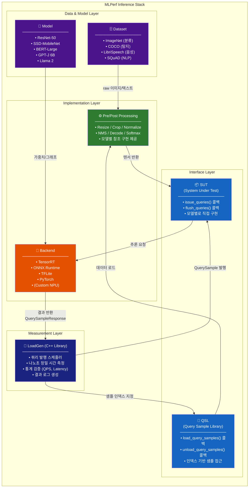
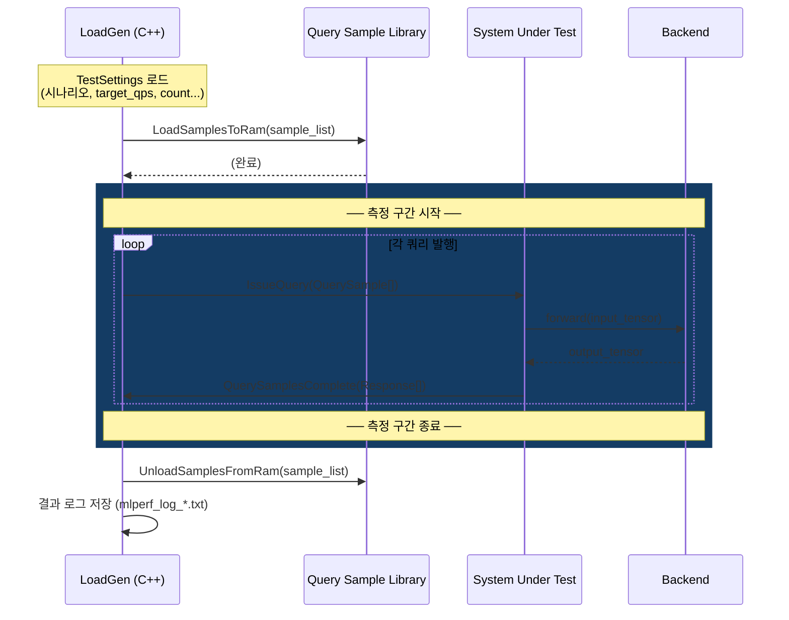
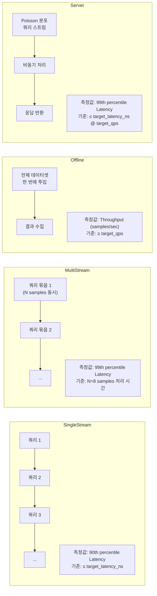
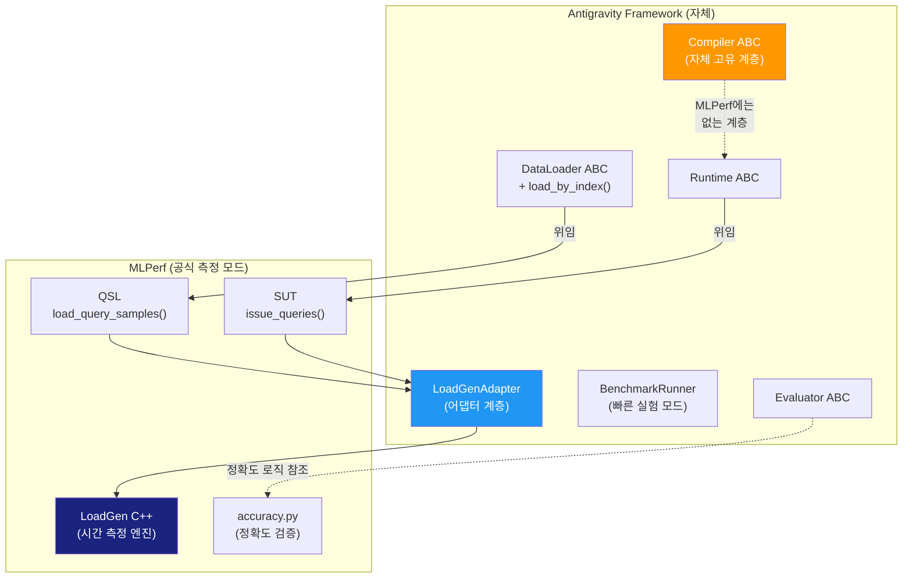

# MLPerf Inference Architecture

> MLPerf Inference v4.x 기준. 공식 레포: [mlcommons/inference](https://github.com/mlcommons/inference)

---

## 1. 전체 계층 구조



---

## 2. LoadGen 동작 방식 (시나리오별)



---

## 3. 4가지 측정 시나리오



| 시나리오 | 대상 환경 | 핵심 지표 |
|--|--|--|
| **SingleStream** | Edge 디바이스 (카메라, 로봇) | P90 Latency |
| **MultiStream** | 멀티카메라, 센서 융합 | P99 Latency |
| **Offline** | 배치 처리, 데이터센터 | Throughput (QPS) |
| **Server** | 실시간 API 서버 | P99 Latency @ QPS |

---

## 4. 디렉토리 구조 (공식 레포)

```
mlcommons/inference/
├── loadgen/                    # C++ LoadGen 코어 + Python 바인딩
│   ├── loadgen.cc              # 시나리오별 쿼리 스케줄러
│   ├── query_sample_library.h  # QSL 인터페이스 정의
│   └── system_under_test.h     # SUT 인터페이스 정의
│
├── vision/
│   └── classification_and_detection/
│       └── python/
│           ├── dataset.py      # Dataset ABC + Imagenet / COCO 구현
│           ├── main.py         # SUT + QSL 콜백 조립 진입점
│           └── backend_*.py    # TF / ONNX / TFLite 백엔드
│
├── language/                   # BERT, GPT-J, Llama 등 NLP 태스크
├── speech_recognition/         # RNN-T 등 음성 인식 태스크
│
└── compliance/                 # 공식 제출 검증 스크립트
    └── nvidia/
        └── TEST01/ ...         # 제출 규정 준수 테스트
```

---

## 5. Antigravity ↔ MLPerf 컴포넌트 매핑



| Antigravity | MLPerf 대응 | 비고 |
|--|--|--|
| `DataLoader.load_by_index()` | `QSL.LoadSamplesToRam()` | 인덱스 기반 샘플 접근 |
| `Runtime.run()` | `SUT.IssueQuery()` 내부 | 추론 실행 |
| `BenchmarkRunner` | `LoadGen` + `main.py` | 단, LoadGen이 C++ 정밀도 |
| `Evaluator` | `accuracy.py` | 전/후처리 알고리즘 참조 |
| `Compiler` ABC | **(없음)** | Antigravity 고유 계층 |
| `LoadGenAdapter` | `SUT` + `QSL` 구현체 | 어댑터 브릿지 |

---

## 6. 공식 제출(Submission) 구조

```
submission/
├── systems/
│   └── {system_name}.json          # HW 스펙 (CPU, RAM, NPU 등)
├── measurements/
│   └── {system}/{model}/{scenario}/
│       ├── mlperf.conf             # LoadGen 설정
│       └── user.conf               # 사용자 오버라이드
└── results/
    └── {system}/{model}/{scenario}/
        ├── performance/
        │   └── run_1/
        │       └── mlperf_log_summary.txt   # ✅ 공식 측정 결과
        └── accuracy/
            └── mlperf_log_accuracy.json     # ✅ 정확도 검증 결과
```

> [!NOTE]
> Antigravity에서 공식 제출을 목표로 한다면 `LoadGenAdapter`가 위 `measurements/` + `results/` 디렉토리 구조를 자동 생성하도록 Phase 4에서 구현하면 됩니다.
